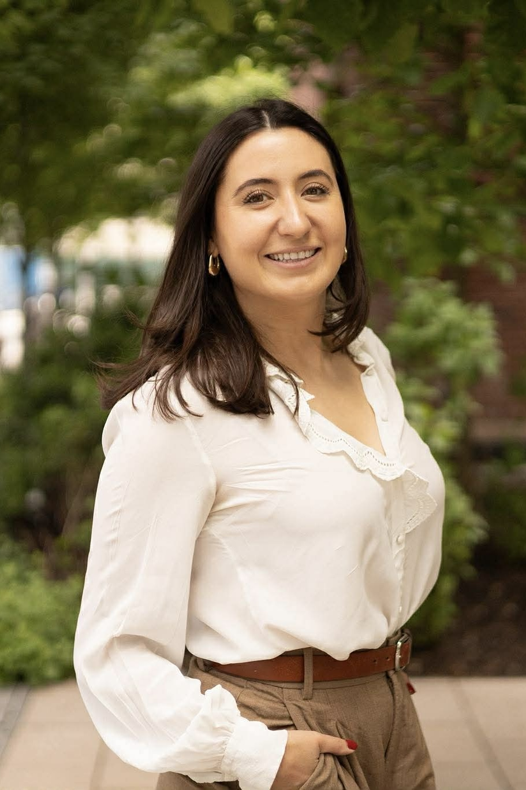

{.profile-pic}

::: {.about-links}
<a href="mailto:gskulski@mit.edu" class="about-link"><i class="bi bi-envelope"></i></a><a href="https://github.com/gskulski" class="about-link"><i class="bi bi-github"></i></a><a href="https://scholar.google.com/citations?user=1EbUmSsAAAAJ&hl=en&oi=ao" class="about-link"><i class="bi bi-mortarboard-fill"></i></a><a href="https://www.linkedin.com/in/gabrielle-peloquin-skulski/" class="about-link"><i class="bi bi-linkedin"></i></a>
:::

Je suis doctorante en science politique au Massachusetts Institute of Technology (MIT). Mes recherches portent sur la communication politique, le comportement politique et l'opinion publique. J'étudie comment les caractéristiques du contenu politique et l'offre d'information influencent les attitudes, les croyances et le comportement en ligne. Je m'intéresse particulièrement aux attitudes des citoyens face à l'hostilité politique, à la mésinformation et aux contenus générés par l'intelligence artificielle. Sur le plan méthodologique, je mène des expériences par sondage et des méta-analyses, et j'analyse des données de comportements en ligne.

Ma thèse examine l'hostilité politique dans les contenus d'actualité et la manière dont les Américains interagissent avec ce contenu en ligne. L'un de mes articles issu de ces recherches a reçu le [prix Timothy E. Cook](https://apsanet.org/membership/organized-sections/organized-section-awards/past-awards/section-23/) de l'American Political Science Association, décerné au meilleur article étudiant en communication politique.

Un autre volet de mes recherches porte sur la manière dont les technologies d'IA transforment l'environnement politique. Je m'intéresse notamment aux politiques visant à informer le public de la provenance et de l'authenticité du contenu, ainsi qu'à leurs effets sur la confiance, les croyances et les interactions en ligne. Ces travaux, menés en collaboration avec David G. Rand et Adam J. Berinsky, ont reçu le soutien d’une [bourse de recherche de Microsoft](https://www.microsoft.com/en-us/research/project/project-provenance/fellowships/). J'étudie également l'utilisation de l'IA dans les campagnes électorales et l'opinion publique à l'égard de ces nouvelles pratiques.

J'ai obtenu un baccalauréat (*honors*) et une maîtrise de l'Université de Montréal avant de commencer mon doctorat au MIT. En dehors de mes activités de recherche, j'aime faire du vélo, skier et cuisiner.

Vous pouvez me joindre à l'adresse suivante: [gskulski@mit.edu](mailto:gskulski@mit.edu).

*Note: Please use the toggle at the top of the page to view the English version of my website.*

